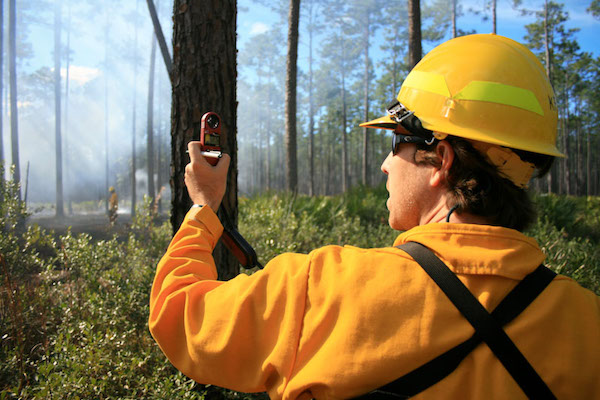

# About

FireWeatherExplorer is an actively developed project to make it easier to determine when conditions may occur that are conducive for prescribed fires. The project uses fire weather data from (Mesowest)[mesowest.utah.edu] (using the [Mesowest API](https://synopticlabs.org/api/mesonet/reference/) and the [`mesowest` R package](https://github.com/fickse/mesowest)) as inputs. Currently, only [RAWS stations](https://raws.nifc.gov/) are included. 

## Workflow

1. Identify the weather station closest to your project site. Click "submit"
2. Assess the data quality by viewing the 'Data Quality' charts. Change the Period of Interest on the Station Selection page if some years seem unrepresentative or have questionable data quality.
3. Enter your prescription parameters on the side bar of 'Prescription Plots' page. Select different plots to identify periods when prescription elements are most common.

## Purpose

It can be difficult to know when conditions are likely for a prescribed fire. This tool aims to make it easier to sift through historical weather data to find trends in prescription windows.

## Development

This project is actively in development. Please see the [Github repository](https://github.com/danielg7/FireWeatherExplorer) for development questions and source code. 

For known bugs and feature requests, see the [Github issues page](https://github.com/danielg7/FireWeatherExplorer/issues).

This project is ongoing and may contain any number of bugs. If you find something strange, please contact the developers.

## Contact

Daniel Godwin
danielg7@gmail.com

