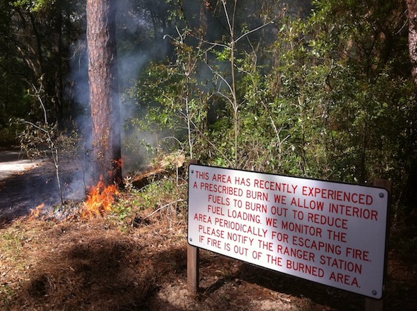
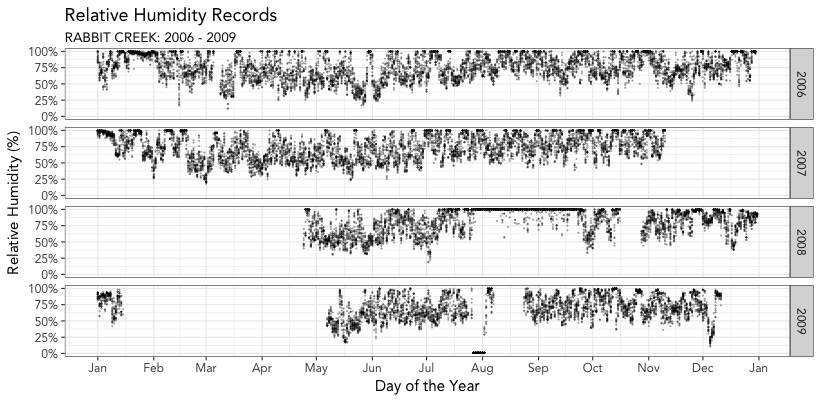

# Help

## Station Selection

Station selection is where it all begins.

Steps:  
1. Select your state of interest  
2. Select your county of interest  
3. Pick the RAWS closest to your project area. Note how the map changes. Make sure this one is close to where you are trying to work!  
4. Select your period of record.  
5. Click "Submit" 

The data will download and you will be taken to the Data Quality plots page.

## Data Quality Plots

These plots are useful for assessing the quality of the input data. Sometimes RAWS station sensors fail and erroneous readings are received. Other times, data are simply missing.

In the above example, see how data are missing in 2008? And at some points, RH just reads 100% for a long period of time? These are "red flags", because that could throw of your analysis down the line. Better to pick years that are not problematic. If your data has lots of problems, try picking a different period of interest. 

## Station Summary Data

Sometimes it is useful to gain a big picture understanding of an area's weather. The box-and-whisker plots shown here show the median and quartile values across all months and all hours. For monthly data, all hours are included in the analysis, not just the 1300 weather reading (as is common in other fire weather programs.)

## Prescription Plots

Prescription plots are intended to improve your understanding of when fire weather conditions conducive to your prescribed fire might occur.

### Prescription Elements Sidebar

Select the elements to include in the "prescription". Wind speeds are 20 foot winds as reported by the RAWS.

### Hours In Prescription

This figure shows the number of hours in prescription across your period of record. Bigger dots show more hours, smaller dots show fewer hours. The box as shown displays the prescription window as defined by hours and months. A density plot shows the rough area in which there may be potential burn windows. 

### Percent of Months in Prescription

This figure shows the percent of hours in prescription within each month of your period of record. Note the y-axis for  percentages!

